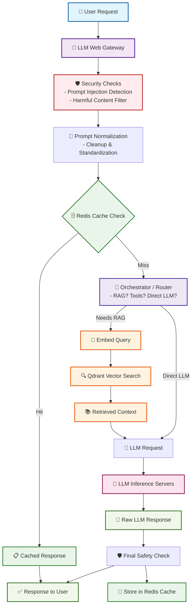
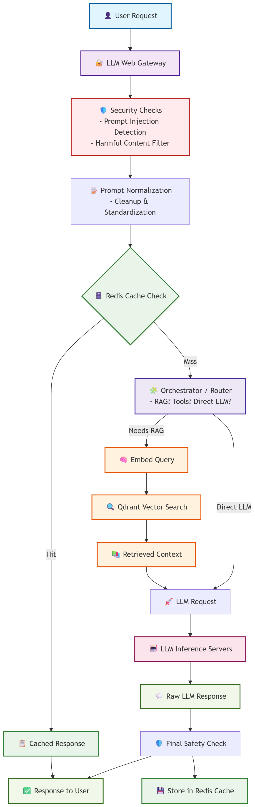

## Architecture

### Architecture Overview

### Data Flow

1. **User Request** → Security validation → Prompt normalization
2. **Cache Check** → Redis for exact matches of normalized prompt (as key)
3. **Cache Miss** → Orchestrator decides: RAG or Direct LLM
4. **RAG Path** → Embedding generation → Qdrant semantic search → LLM with context
5. **Direct LLM Path** → LLM servers
6. **New Prompts** → LLM servers → Response caching
7. **Final Security Check** → Response delivery

### Key Components

- **🔐 Security**: Multi-layer security validation (prompt injection, harmful content)
- **🗄️ Redis**: Fast key-value cache for exact prompt matches
- **🔍 Qdrant**: Vector database for semantic similarity search
- **🧠 Embeddings**: Text-to-vector conversion for semantic matching
- **🤖 LLM Servers**: Actual inference endpoints
